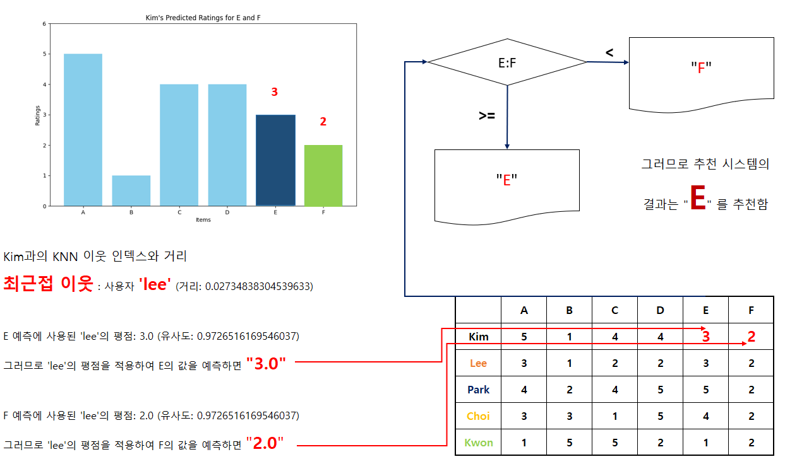

# 협업 필터링을 활용한 추천 시스템 개발

협업 필터링(Collaborative Filtering)은 추천 시스템에서 가장 널리 사용되는 방법 중 하나로, 사용자들의 과거 행동이나 선호도를 바탕으로 다른 사용자가 좋아할 만한 항목을 추천하는 방법입니다. 협업 필터링은 크게 두 가지 방식으로 나뉩니다: 사용자 기반 협업 필터링과 아이템 기반 협업 필터링입니다.

<br>

## 1. 코사인 유사도와 협업 필터링

코사인 유사도는 두 벡터 간의 유사도를 측정하는 방법으로, 협업 필터링에서 사용자나 아이템 간의 유사도를 계산하는 데 자주 사용됩니다. 코사인 유사도는 벡터 간의 각도를 기반으로 유사도를 측정하며, 두 벡터가 완전히 동일한 방향일 때 1에 가까운 값을 가지며, 완전히 다른 방향일 때 -1에 가까운 값을 가집니다.


<br><br>

## 2. 사용자 기반 협업 필터링 (User-based Collaborative Filtering)

이 방식에서는 사용자의 평점 데이터를 기반으로 유사한 사용자 그룹을 찾습니다. 예를 들어, Kim 사용자가 특정 영화를 아직 보지 않았다고 할 때, Kim과 유사한 다른 사용자들이 해당 영화를 좋아했다면, 그 영화를 Kim에게 추천할 수 있습니다.

유사한 사용자 찾기: Kim과 다른 사용자들의 평점을 코사인 유사도를 이용해 비교하여 Kim과 유사한 사용자들을 찾습니다.
추천 계산: 유사한 사용자들이 높은 점수를 준 아이템(영화 등)을 Kim에게 추천합니다.

<br><br>

## 3. 아이템 기반 협업 필터링 (Item-based Collaborative Filtering)

이 방식에서는 아이템 간의 유사도를 바탕으로 추천을 수행합니다. 예를 들어, Kim이 특정 영화를 좋아했다면, 그 영화와 유사한 다른 영화들을 추천할 수 있습니다.

유사한 아이템 찾기: 각 영화 간의 유사도를 코사인 유사도를 통해 계산합니다.
추천 계산: 사용자가 평가한 아이템들과 유사한 아이템을 찾아 추천합니다

<br><br>

## 4. 코사인 유사도를 이용한 추천 프로세스

1. 데이터 수집: 사용자들이 아이템에 대해 평가한 평점 데이터가 필요합니다.
2. 유사도 계산: 코사인 유사도를 이용해 사용자 간 또는 아이템 간의 유사도를 계산합니다.
3. 가중 평균 계산: 유사도를 가중치로 하여 결측값(즉, 사용자가 아직 평가하지 않은 아이템에 대한 예측값)을 계산합니다.
4. 추천: 예측된 평점이 높은 아이템을 사용자에게 추천합니다.

<br><br>

## 5. 예시 데이터의 추천 프로세스 설계

**1. 로딩되는 예시 데이터**

| 사용자 | 아이템 1 | 아이템 2 | 아이템 3 | 아이템 4 | 아이템 5 | 아이템 6 |
|--------|----------|----------|----------|----------|----------|----------|
| Kim    | 5        | 1        | 4        | 4        | ?        | ?        |
| Lee    | 3        | 1        | 2        | 2        | 3        | 2        |
| Park   | 4        | 2        | 4        | 5        | 5        | 1        |
| Choi   | 3        | 3        | 1        | 5        | 4        | 3        |
| Kwon   | 1        | 5        | 5        | 2        | 1        | 4        |

<br>

**2. 계산된 코사인 유사도**

|       | A | B | C | D | E | F | 코사인 유사도  |
|-------|---|---|---|---|---|---|----------------|
| kim   | 5 | 1 | 4 | 4 |   |   |                |
| lee   | 3 | 1 | 2 | 2 | 3 | 2 | 0.990375137    |
| park  | 4 | 2 | 4 | 5 | 5 | 1 | 0.975099827    |
| choi  | 3 | 3 | 1 | 5 | 4 | 3 | 0.831397962    |
| kwon  | 1 | 5 | 5 | 2 | 1 | 4 | 0.67280352     |

<br>

**3. 결측치에 대한 결측 대상**

| 사용자 | 아이템 1 | 아이템 2 | 아이템 3 | 아이템 4 | 아이템 5 | 아이템 6 |
|--------|----------|----------|----------|----------|----------|----------|
| Kim    | 5        | 1        | 4        | 4        | ?        | ?        |

<br>

**4. Kim의 평점 예측치**

|       | A | B | C | D | E           | F           |
|-------|---|---|---|---|-------------|-------------|
| kim   | 5 | 1 | 4 | 4 | **3.397**   | **2.36254** |
| lee   | 3 | 1 | 2 | 2 | 3           | 2           |
| park  | 4 | 2 | 4 | 5 | 5           | 1           |
| choi  | 3 | 3 | 1 | 5 | 4           | 3           |
| kwon  | 1 | 5 | 5 | 2 | 1           | 4           |

<br>

**5. 결과 출력**

```console
Kim의 다섯 번째 값: 3.39702127399391
Kim의 여섯 번째 값: 2.3625384640129212
추천: E
```

<br>

1. Kim의 아이템 5와 6에 대한 평점을 데이터를 로딩합니다.
2. Kim과 다른 사용자들 (Lee, Park, Choi, Kwon) 간의 유사도를 계산합니다. 
3. 계산된 유사도를 가중치로 사용하여 결측값을 계산합니다. 
4. Lee, Park, Choi, Kwon의 아이템 5와 6에 대한 평가를 바탕으로 Kim의 평점을 예측합니다.
5. Kim의 다섯 번째와 여섯 번째 값에 대한 레이블 결정하여 결과를 출력하도록 합니다.

<br><br>

## 6. 협업 필터링을 활용한 추천 시스템 프로그래밍

### 6-1. 데이터 로딩


```python
import pandas as pd

# 파일 경로 설정 (kim.txt 파일이 있는 위치)
file_path = 'kim.txt'

# 데이터를 읽어오기
data = []
with open(file_path, 'r', encoding='utf-8') as file:
    for line in file:
        parts = line.strip().split(',')
        data.append(parts)

# 데이터프레임으로 변환
columns = ['User'] + list('ABCDEF')
df = pd.DataFrame(data, columns=['User', 'Item', 'Rating'])
df = df.pivot(index='User', columns='Item', values='Rating').reset_index()

# 결과 출력
print(df)

# 결측값을 NaN으로 변환하고, 정렬
df.replace('', pd.NA, inplace=True)
df = df.reindex(columns=columns)
df.set_index('User', inplace=True)

# DataFrame 출력
print(df)
```


<br><br>

### 6-2. 코사인 유사도 계산


```python
import numpy as np
import pandas as pd
from sklearn.metrics.pairwise import cosine_similarity

# 파일 경로 설정 (kim.txt 파일이 있는 위치)
file_path = 'kim.txt'

# 데이터를 읽어오기
data = []
with open(file_path, 'r', encoding='utf-8') as file:
    for line in file:
        parts = line.strip().split(',')
        data.append(parts)

users = ['kim', 'lee', 'park', 'choi', 'kwon']

# 데이터프레임 생성
df = pd.DataFrame(data, index=users)

# 결측값을 각 열의 평균으로 채우기
df_filled = df.apply(lambda col: col.fillna(col.mean()), axis=0)

# 코사인 유사도 계산
cos_sim = cosine_similarity(df_filled)

# 코사인 유사도를 데이터프레임으로 변환하여 사용자별 유사도 값 추가
cos_sim_df = pd.DataFrame(cos_sim, index=users, columns=users)

# 사용자별로 kim과의 코사인 유사도 값 추출
cos_sim_with_kim = cos_sim_df['kim']

# 원래 데이터프레임에 코사인 유사도 값 추가
df['코사인 유사도'] = cos_sim_with_kim

# 결과 출력
print(df)
```

<br><br>

### 6-3. KNN(K 최근접 이웃) 알고리즘에 의한 계산


```python
import numpy as np
import pandas as pd
from sklearn.metrics.pairwise import cosine_similarity
from sklearn.neighbors import NearestNeighbors
import matplotlib.pyplot as plt

# 1. 파일 읽기 및 데이터 로딩
file_path = 'kim.txt'
data = []

with open(file_path, 'r', encoding='utf-8') as file:
    for line in file:
        parts = line.strip().split(',')
        user, item, rating = parts[0], parts[1], parts[2]
        if rating == '':
            rating = np.nan
        else:
            rating = float(rating)
        data.append((user, item, rating))

# 데이터프레임으로 변환
df = pd.DataFrame(data, columns=['User', 'Item', 'Rating'])
df_pivot = df.pivot(index='User', columns='Item', values='Rating')

# 데이터프레임 인덱스 확인
print("데이터프레임 인덱스:")
print(df_pivot.index)

# 2. 결측값을 각 열의 평균으로 채우기
df_filled = df_pivot.apply(lambda col: col.fillna(col.mean()), axis=0)

# 3. 코사인 유사도 계산
cos_sim = cosine_similarity(df_filled)

# 코사인 유사도 행렬 출력
users = df_pivot.index.tolist()
cos_sim_df = pd.DataFrame(cos_sim, index=users, columns=users)
print("코사인 유사도 행렬:")
print(cos_sim_df)

# 4. KNN 설정
k = 2  # K값 설정 (예시로 2 설정)
neigh = NearestNeighbors(n_neighbors=k, metric='cosine')
neigh.fit(df_filled)

# Kim의 인덱스 확인
if 'Kim' in df_filled.index:
    kim_index = 'Kim'
elif 'kim' in df_filled.index:
    kim_index = 'kim'
else:
    raise KeyError("'Kim' 또는 'kim'이라는 인덱스가 존재하지 않습니다.")

# Kim의 이웃 찾기 (사용자 인덱스 0)
distances, indices = neigh.kneighbors([df_filled.loc[kim_index]])

# Kim의 이웃 인덱스 추출 및 거리 출력
print("\nKim의 KNN 이웃 인덱스와 거리:")
for i, index in enumerate(indices[0]):
    print(f"이웃 {i+1}: 사용자 '{users[index]}' (거리: {distances[0][i]})")

# 5. 결측값에 대한 가중 평균 계산
recommendations = {}
for item in ['E', 'F']:
    item_index = df_filled.columns.get_loc(item)
    weighted_sum = 0
    similarity_sum = 0
    for neighbor_index in indices[0]:
        if not np.isnan(df_filled.iloc[neighbor_index, item_index]):
            similarity = 1 - distances[0][indices[0].tolist().index(neighbor_index)]  # 코사인 거리 -> 유사도로 변환
            rating = df_filled.iloc[neighbor_index, item_index]
            weighted_sum += similarity * rating
            similarity_sum += similarity
            print(f"\n{item} 예측에 사용된 '{users[neighbor_index]}'의 평점: {rating} (유사도: {similarity})")
    if similarity_sum != 0:
        recommendations[item] = weighted_sum / similarity_sum
        print(f"{item}의 예측 값: {recommendations[item]}")

# 6. 결과 그래프
labels = ['A', 'B', 'C', 'D', 'E', 'F']
kim_values = [
    df_filled.loc[kim_index, 'A'],
    df_filled.loc[kim_index, 'B'],
    df_filled.loc[kim_index, 'C'],
    df_filled.loc[kim_index, 'D'],
    recommendations.get('E', np.nan),
    recommendations.get('F', np.nan)
]

plt.figure(figsize=(10, 6))
plt.bar(labels, kim_values, color='skyblue')
plt.title("Kim's Predicted Ratings for E and F")
plt.xlabel("Items")
plt.ylabel("Ratings")
plt.ylim(0, 6)
plt.show()
```

```console
Kim의 다섯 번째 값: 3.39702127399391
Kim의 여섯 번째 값: 2.3625384640129212
추천: E
```

<br><br>

### 6-4. 예측 결과



<br><br>

### 6-5. 추천 엔진 모델의 평가 (결과 검증)


```python
# MSE 및 RMSE 계산
# Kim의 E와 F의 실제 값이 수동으로 입력되었다고 가정
recommendations = {'E':3.7, 'F':2.2}
true_values = [4, 3]  # 임의 값이며, 실제 값이 있다면 해당 값으로 대체해야 합니다.
pred_values = [recommendations['E'], recommendations['F']]

mse = mean_squared_error(true_values, pred_values)
rmse = np.sqrt(mse)

print("코사인 유사도 매트릭스:")
print(cos_sim_df)
print("\nKim에 대한 추천 (사용자 0):")
print(recommendations)
print(f"\nMSE: {mse}, RMSE: {rmse}")

# MSE와 RMSE 그래프 그리기
plt.figure(figsize=(10, 6))
plt.plot(['E', 'F'], true_values, label='True Values', marker='o', linestyle='--', color='blue')
plt.plot(['E', 'F'], pred_values, label='Predicted Values', marker='o', linestyle='-', color='red')

plt.title('True vs Predicted Values')
plt.xlabel('Items')
plt.ylabel('Rating')
plt.legend()
plt.grid(True)
plt.show()
```

<br><br>
