# 1. 원본 데이터

## 1-1. test_scores.csv 파일

- 사전 평가에 의해 만들어진 파일 입니다.

| 필드명 | 설명 |
|----------------------|----------------------------|
| school_no | 학번 |
| Chapter | 출제 문제문항의 Chapter |
| Point | 사전평가 점수 |

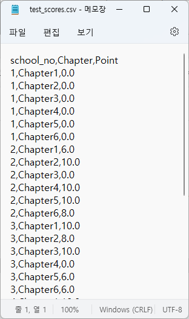

<br><br>

## 1-2. test_question.csv 파일

- 응시자에게 출제된 내역이 저장되어 있는 파일 입니다.

| 필드명 | 설명 |
|----------------------|----------------------------|
| school_no| 학번 |
| Chapter | 출제 문제문항의 Chapter |
| Difficulty | 출제할 문항의 난이도 |
| Random_number | 해당 난이도별 1~5. 랜덤수 |
| Problem_number | 출제되는 문제은행에서의 문제번호
| Answer | 응시자가 제출한 답안 |
| Result | 채점 결과 |

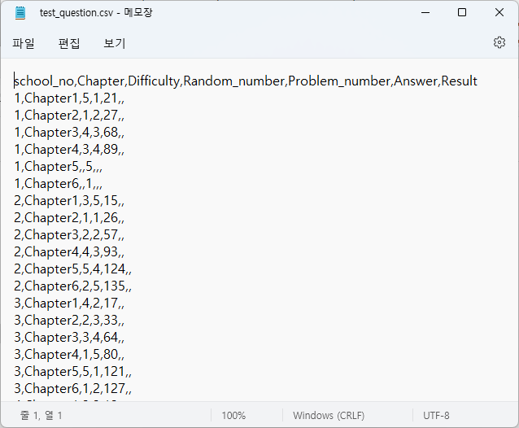

<br><br>

## 1-3. test_bank.csv 파일

- 문제 은행파일로서 전체 문항에 대한 정보가 저장되어 있는 파일 입니다.

| 필드명 | 설명 |
|----------------------|----------------------------|
| Problem_number | 문제번호 |
| Chapter | 출제 문제문항의 Chapter |
| Difficulty | 출제할 문항의 난이도 |
| Random_number | 해당 난이도별 1~5. 랜덤수 |
| ChapterPerNo | 하나의 Chapter 내에서의 순번 |
| Problem_content | 문제 내용 |
| Problem_answer | 문제 정답 |

<br><br>

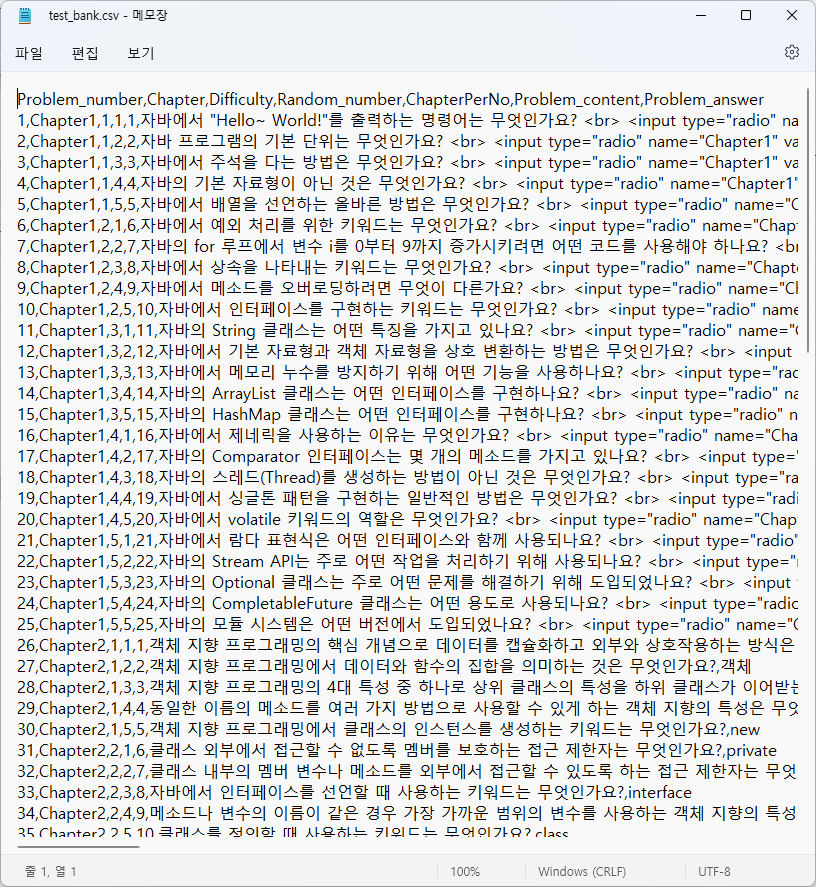

## 1-4. test_user.csv 파일

- 응시하는 학생에 대한 정보가 저장되어 있는 파일 입니다.

| 필드명 | 설명 |
|----------------------|----------------------------|
| school_no | 학번 |
| name | 응시자 이름 |
| birth | 생년월일 |
| tel | 전화번호 |
| addr | 주소 |
| Point | 총점 |

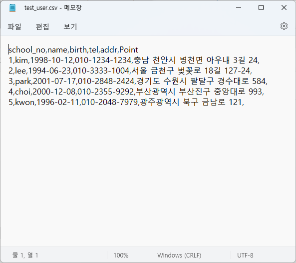

<br><br><br><br>

# 2. 문제 추천 및 처리 프로세스

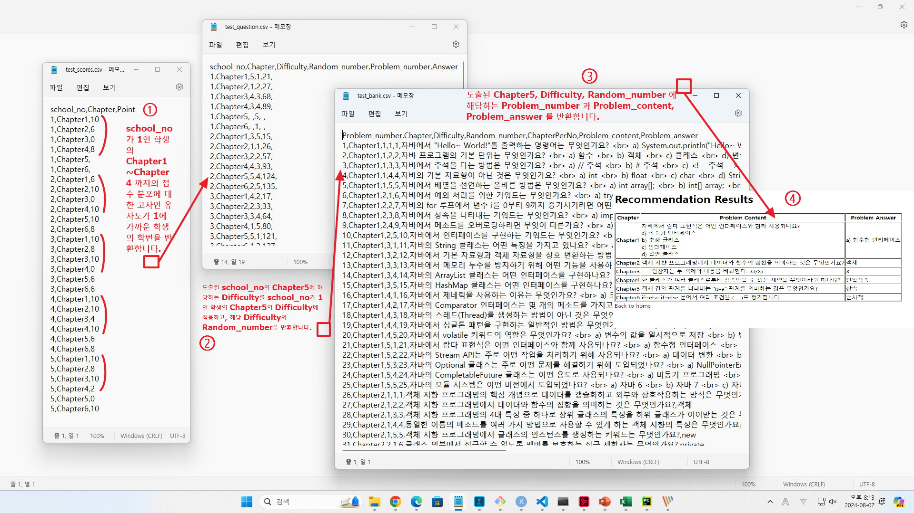

<br><br><br><br>

## 1-1. 웹 브라우저의 URL 입력칸에서 "127.0.0.1" 엔터를 치면 메인 페이지가 로딩됩니다.

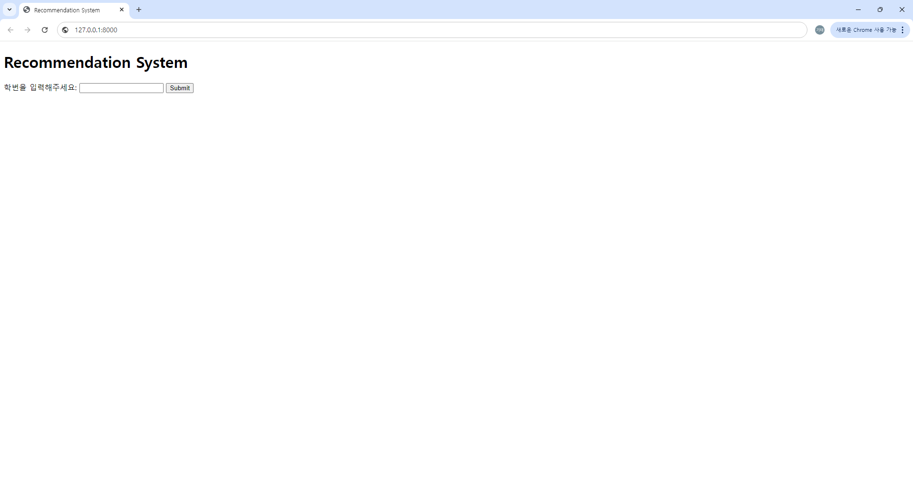

<br><br>

## 1-2. 해당 학생의 학번을 입력하고, [submit] 버튼을 누릅니다.

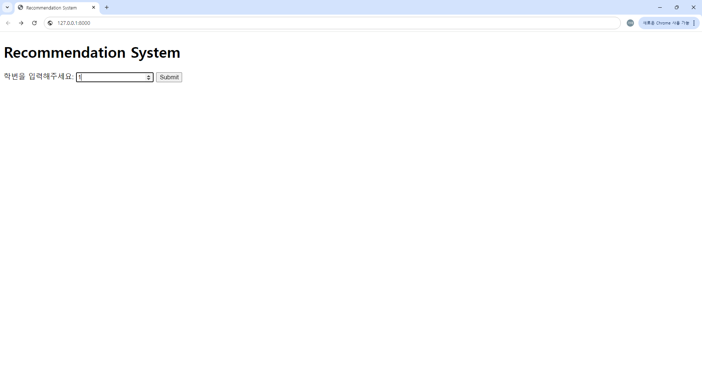

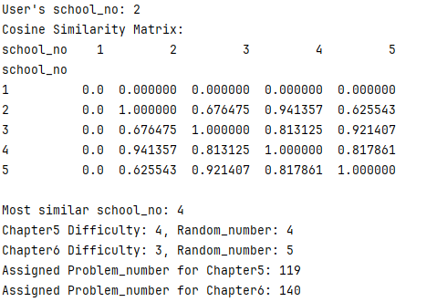

<br><br>

## 1-3. 프로세스의 순서에 따라 코사인 유사도를 구하고, 점수 분포가 가장 유사한 학생의 난이도를 구하여 요청한 학생의 Chapter1 ~ Chapter6에 해당하는 문제를 불러와 표시합니다.

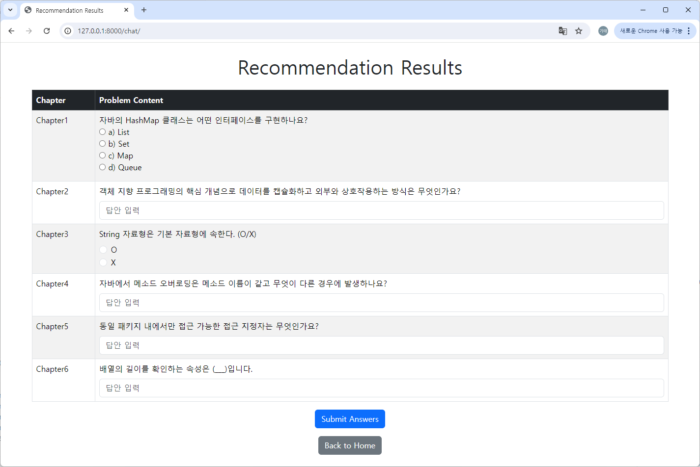

<br><br>

## 1-4. 출력된 문제지를 Chapter1 ~ Chapter6에 해당하는 문제를 풀고, [Submit] 버튼을 누릅니다.

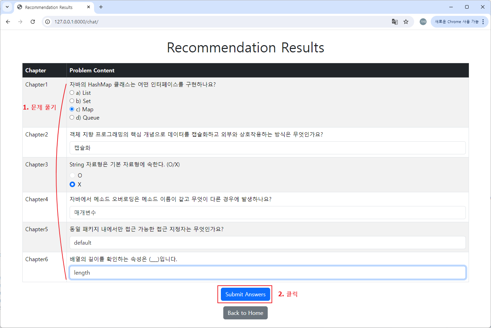

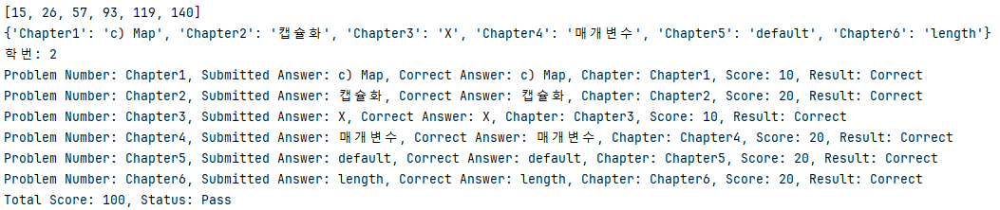

<br>

**문제 결과**

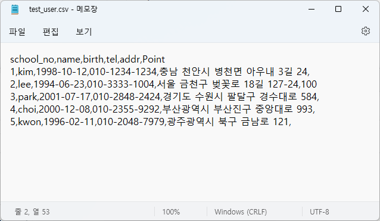

<br><br><br><br>

# 3. 프로젝트 정보

## 3-1. 프로젝트 구조 및 생성

### 3-1-1. 프로젝트 구조

```lua
/test_bank/               # 프로젝트의 루트 디렉터리
│
├── manage.py                # Django 명령어 유틸리티
├── /test_bank/           # 메인 프로젝트 디렉터리
│   ├── __init__.py          # 프로젝트 패키지 초기화 파일
│   ├── settings.py          # 프로젝트 설정 파일
│   ├── urls.py              # 프로젝트 URL 라우팅 파일
│   ├── wsgi.py              # WSGI 설정 파일
│   └── asgi.py              # ASGI 설정 파일
│
├── /myapp/                  # Django 앱 디렉터리
│   ├── __init__.py          # 앱 패키지 초기화 파일
│   ├── admin.py             # 관리자 사이트 설정 파일
│   ├── apps.py              # 앱 설정 파일
│   ├── models.py            # 데이터베이스 모델 파일
│   ├── views.py             # 뷰 로직 파일
│   ├── urls.py              # 앱별 URL 라우팅 파일
│   ├── tests.py             # 테스트 케이스 파일
│   ├── /migrations/         # 마이그레이션 파일 디렉터리
│   └── /templates/          # 템플릿 디렉터리
│       ├── chat.html        # 메인 출력 템플릿
│       ├── index.html       # 메인 템플릿
│       ├── results.html     # 문제지 출력 템플릿
│       ├── submission_success.html  # 제출 성공 템플릿
│       └── test_paper.html  # 문제지 형식 템플릿
│
├── test_bank.csv            
├── test_question.csv            
├── test_scores.csv            
├── test_user.csv            
└── updated_test_question.csv            
```

<br>

###  3-1-2. Django 설치 및 프로젝트 생성

```console
# 장고 설치
pip install django

# 장고 프로젝트 생성
django-admin startproject test_bank

# 디렉토리 이동
cd test_bank

# 서버 실행
python manage.py runserver
```

<br><br>

## 3-2. 환경 설정 파일 소스 코드

### 3-2-1. myapp/urls.py

```python
# myapp/urls.py
from django.urls import path
from . import views

urlpatterns = [
    path('', views.index_view, name='index'),  # 루트 URL에 index_view를 연결
    path('chat/', views.chat_view, name='chat'),
    path('recommendation/', views.recommendation_view, name='recommendation'),
    path('submit/', views.submit_answers, name='submit_answers'),
]
```

<br>


### 3-2-2. test_bank/asgi.py

```python
import os
from django.core.asgi import get_asgi_application

os.environ.setdefault('DJANGO_SETTINGS_MODULE', 'test_bank.settings')

application = get_asgi_application()
```

<br>

### 3-2-3. test_bank/settings.py

```python
"""
Django settings for test_bank project.

Generated by 'django-admin startproject' using Django 5.0.8.

For more information on this file, see
https://docs.djangoproject.com/en/5.0/topics/settings/

For the full list of settings and their values, see
https://docs.djangoproject.com/en/5.0/ref/settings/
"""

from pathlib import Path

# Build paths inside the project like this: BASE_DIR / 'subdir'.
BASE_DIR = Path(__file__).resolve().parent.parent


# Quick-start development settings - unsuitable for production
# See https://docs.djangoproject.com/en/5.0/howto/deployment/checklist/

# SECURITY WARNING: keep the secret key used in production secret!
SECRET_KEY = 'django-insecure-yhd%1ct!2ne9vdff@6qma9%mhi9n2henqd810n*10lj1-6$fxc'

# SECURITY WARNING: don't run with debug turned on in production!
DEBUG = True

ALLOWED_HOSTS = []


# Application definition

INSTALLED_APPS = [
    'django.contrib.admin',
    'django.contrib.auth',
    'django.contrib.contenttypes',
    'django.contrib.sessions',
    'django.contrib.messages',
    'django.contrib.staticfiles',
    'myapp',
]

MIDDLEWARE = [
    'django.middleware.security.SecurityMiddleware',
    'django.contrib.sessions.middleware.SessionMiddleware',
    'django.middleware.common.CommonMiddleware',
    'django.middleware.csrf.CsrfViewMiddleware',
    'django.contrib.auth.middleware.AuthenticationMiddleware',
    'django.contrib.messages.middleware.MessageMiddleware',
    'django.middleware.clickjacking.XFrameOptionsMiddleware',
]

ROOT_URLCONF = 'test_bank.urls'

TEMPLATES = [
    {
        'BACKEND': 'django.template.backends.django.DjangoTemplates',
        'DIRS': [],
        'APP_DIRS': True,
        'OPTIONS': {
            'context_processors': [
                'django.template.context_processors.debug',
                'django.template.context_processors.request',
                'django.contrib.auth.context_processors.auth',
                'django.contrib.messages.context_processors.messages',
            ],
        },
    },
]

WSGI_APPLICATION = 'test_bank.wsgi.application'


# Database
# https://docs.djangoproject.com/en/5.0/ref/settings/#databases

DATABASES = {
    'default': {
        'ENGINE': 'django.db.backends.sqlite3',
        'NAME': BASE_DIR / 'db.sqlite3',
    }
}


# Password validation
# https://docs.djangoproject.com/en/5.0/ref/settings/#auth-password-validators

AUTH_PASSWORD_VALIDATORS = [
    {
        'NAME': 'django.contrib.auth.password_validation.UserAttributeSimilarityValidator',
    },
    {
        'NAME': 'django.contrib.auth.password_validation.MinimumLengthValidator',
    },
    {
        'NAME': 'django.contrib.auth.password_validation.CommonPasswordValidator',
    },
    {
        'NAME': 'django.contrib.auth.password_validation.NumericPasswordValidator',
    },
]


# Internationalization
# https://docs.djangoproject.com/en/5.0/topics/i18n/

LANGUAGE_CODE = 'en-us'

TIME_ZONE = 'UTC'

USE_I18N = True

USE_TZ = True


# Static files (CSS, JavaScript, Images)
# https://docs.djangoproject.com/en/5.0/howto/static-files/

STATIC_URL = 'static/'

# Default primary key field type
# https://docs.djangoproject.com/en/5.0/ref/settings/#default-auto-field

DEFAULT_AUTO_FIELD = 'django.db.models.BigAutoField'
```

<br>

### 3-2-4. test_bank/urls.py

```python
# test_bank/urls.py
from django.contrib import admin
from django.urls import path, include

urlpatterns = [
    path('admin/', admin.site.urls),
    path('', include('myapp.urls')),  # myapp의 URL 패턴을 포함
]
```

<br>

### 3-2-5. test_bank/wsgi.py

```python
import os

from django.core.wsgi import get_wsgi_application

os.environ.setdefault('DJANGO_SETTINGS_MODULE', 'test_bank.settings')

application = get_wsgi_application()
```

<br>

### 3-2-6. manage.py

```python
#!/usr/bin/env python
"""Django's command-line utility for administrative tasks."""
import os
import sys


def main():
    """Run administrative tasks."""
    os.environ.setdefault('DJANGO_SETTINGS_MODULE', 'test_bank.settings')
    try:
        from django.core.management import execute_from_command_line
    except ImportError as exc:
        raise ImportError(
            "Couldn't import Django. Are you sure it's installed and "
            "available on your PYTHONPATH environment variable? Did you "
            "forget to activate a virtual environment?"
        ) from exc
    execute_from_command_line(sys.argv)


if __name__ == '__main__':
    main()
```

<br><br><br>

## 3-3. 애플리케이션 뷰와 처리 모델

### 3-3-1. myapp/views.py

```python
import pandas as pd
from django.http import HttpResponseBadRequest
from sklearn.metrics.pairwise import cosine_similarity
from django.shortcuts import render, redirect
import os
from django.conf import settings

def load_data():
    test_scores = pd.read_csv(os.path.join(settings.BASE_DIR, 'test_scores.csv'))
    test_question = pd.read_csv(os.path.join(settings.BASE_DIR, 'test_question.csv'))
    test_bank = pd.read_csv(os.path.join(settings.BASE_DIR, 'test_bank.csv'))
    return test_scores, test_question, test_bank

def get_recommended_questions(school_no):
    test_scores, test_question, test_bank = load_data()

    # school_no와 Chapter별로 평균 점수 계산
    score_summary = test_scores.groupby(['school_no', 'Chapter']).mean().reset_index()

    # 피벗 테이블 생성 (school_no를 행으로, Chapter를 열로)
    score_pivot = score_summary.pivot(index='school_no', columns='Chapter', values='Point').fillna(0)

    # 코사인 유사도 계산
    cosine_sim = cosine_similarity(score_pivot)

    # 결과를 DataFrame으로 변환
    cosine_sim_df = pd.DataFrame(cosine_sim, index=score_pivot.index, columns=score_pivot.index)

    # 가장 유사한 학생 선택
    target_similarities = cosine_sim_df.loc[school_no].drop(school_no)
    most_similar_school_no = target_similarities.idxmax()

    # 콘솔 출력 추가 - school_no와 코사인 유사도 행렬
    print(f"User's school_no: {school_no}")
    print(f"Cosine Similarity Matrix:\n{cosine_sim_df}\n")
    print(f"Most similar school_no: {most_similar_school_no}")

    # 필요한 레코드 필터링
    record1 = test_question[(test_question['school_no'] == most_similar_school_no) & (test_question['Chapter'] == 'Chapter5')]
    record2 = test_question[(test_question['school_no'] == most_similar_school_no) & (test_question['Chapter'] == 'Chapter6')]

    # 난이도와 랜덤 수를 불러오기
    difficulty1 = int(record1['Difficulty'].values[0])
    difficulty2 = int(record2['Difficulty'].values[0])

    random1 = int(test_question[(test_question['school_no'] == school_no) & (test_question['Chapter'] == 'Chapter5')]['Random_number'].values[0])
    random2 = int(test_question[(test_question['school_no'] == school_no) & (test_question['Chapter'] == 'Chapter6')]['Random_number'].values[0])

    # 콘솔 출력 추가 - Chapter5, Chapter6의 난이도 및 Random_number
    print(f"Chapter5 Difficulty: {difficulty1}, Random_number: {random1}")
    print(f"Chapter6 Difficulty: {difficulty2}, Random_number: {random2}")

    # test_question에 난이도 저장
    test_question.loc[(test_question['school_no'] == school_no) & (test_question['Chapter'] == 'Chapter5'), 'Difficulty'] = difficulty1
    test_question.loc[(test_question['school_no'] == school_no) & (test_question['Chapter'] == 'Chapter6'), 'Difficulty'] = difficulty2

    # test_bank에서 문제의 레코드 불러오기
    bank1 = test_bank[(test_bank['Chapter'] == 'Chapter5') & (test_bank['Difficulty'] == difficulty1) & (test_bank['Random_number'] == random1)]
    bank2 = test_bank[(test_bank['Chapter'] == 'Chapter6') & (test_bank['Difficulty'] == difficulty2) & (test_bank['Random_number'] == random2)]

    # Problem_number 값 불러오기
    p1 = bank1['Problem_number'].values[0]
    p2 = bank2['Problem_number'].values[0]

    # 콘솔 출력 추가 - 추천된 문제번호
    print(f"Assigned Problem_number for Chapter5: {p1}")
    print(f"Assigned Problem_number for Chapter6: {p2}")

    # test_question에 문제번호 저장
    test_question.loc[(test_question['school_no'] == school_no) & (test_question['Chapter'] == 'Chapter5'), 'Problem_number'] = p1
    test_question.loc[(test_question['school_no'] == school_no) & (test_question['Chapter'] == 'Chapter6'), 'Problem_number'] = p2

    # 결과 저장
    test_question.to_csv(os.path.join(settings.BASE_DIR, 'updated_test_question.csv'), index=False)

    # 추천 문제 필터링
    updated_test_question = test_question[test_question['school_no'] == school_no]
    test_loading = updated_test_question[['Problem_number']]
    test_paper = test_bank[test_bank['Problem_number'].isin(test_loading['Problem_number'])]

    # 'is_multiple_choice'와 'options' 컬럼을 선택하지 않고, 존재하는 컬럼만 선택합니다.
    return test_paper[['Problem_number', 'Chapter', 'Problem_content', 'Problem_answer']]


def index_view(request):
    if request.method == 'POST':
        school_no = int(request.POST.get('school_no'))
        test_paper = get_recommended_questions(school_no)
        return render(request, 'results.html', {'test_paper': test_paper.to_dict(orient='records'), 'student_school_no': school_no})

    return render(request, 'index.html')


def submit_answers(request):
    if request.method == 'POST':
        # 폼 데이터에서 학번과 답안을 가져옵니다.
        school_no = request.POST.get('school_no')
        if not school_no:
            return HttpResponseBadRequest("학번이 제공되지 않았습니다.")

        # 폼 데이터에서 문제 번호와 답안을 추출합니다.
        answers = {}
        numbers = request.POST.getlist('problem_numbers')
        problem_numbers = [int(num) for num in numbers]

        chapter_nums = ['Chapter1','Chapter2','Chapter3','Chapter4','Chapter5','Chapter6']
        for chapter_no in chapter_nums:
            answer = request.POST.get(chapter_no)
            if answer:
                answers[chapter_no] = answer.strip()

        # 문제 번호를 정수형으로 변환
        problem_numbers = list(map(int, problem_numbers))

        print(problem_numbers)
        print(answers)

        # CSV 파일 경로 설정
        csv_path = 'updated_test_question.csv'
        test_bank_path = 'test_bank.csv'

        # CSV 파일을 읽어와 DataFrame으로 로드
        test_bank = pd.read_csv(os.path.join(settings.BASE_DIR, 'test_bank.csv'))

        try:
            df = pd.read_csv(csv_path)
            test_bank_df = pd.read_csv(test_bank_path)
        except Exception as e:
            return HttpResponseBadRequest(f"CSV 파일을 로드하는데 문제가 발생했습니다: {e}")

        # 학번이 int형으로 변환 가능한지 확인하고 변환
        try:
            school_no = int(school_no)
        except ValueError:
            return HttpResponseBadRequest("학번은 유효한 숫자여야 합니다.")

        # 문제 번호에 해당하는 데이터만 필터링
        filtered_df = test_bank[test_bank_df['Problem_number'].isin(problem_numbers)]

        # 필요한 컬럼만 선택
        filtered_df = filtered_df[['Problem_number', 'Chapter', 'Problem_answer']]

        # 각 챕터별 점수 매핑
        score_mapping = {
            'Chapter1': 10,
            'Chapter2': 20,
            'Chapter3': 10,
            'Chapter4': 20,
            'Chapter5': 20,
            'Chapter6': 20
        }

        total_score = 0
        grading_results = {}

        # 해당 학번의 행을 찾습니다.
        if school_no in df['school_no'].values:
            print(f"학번: {school_no}")
            num = 0
            for problem_number, answer in answers.items():
                # 문제 번호에 해당하는 정답을 test_bank_df에서 가져옴
                matching_rows = filtered_df[filtered_df['Chapter'] == problem_number]
                if not matching_rows.empty:
                    correct_answer = matching_rows['Problem_answer'].values[0].strip()
                    chapter = matching_rows['Chapter'].values[0]

                    is_correct = answer == correct_answer
                    points = score_mapping.get(chapter, 0) if is_correct else 0
                    total_score += points

                    # 콘솔에 출력
                    print(
                        f"Problem Number: {problem_number}, Submitted Answer: {answer}, Correct Answer: {correct_answer}, Chapter: {chapter}, Score: {points}, Result: {'Correct' if is_correct else 'Incorrect'}")

                    grading_results[problem_number] = {
                        'submitted_answer': answer,
                        'correct_answer': correct_answer,
                        'chapter': chapter,
                        'points': points,
                        'is_correct': is_correct
                    }

                    # 응시자의 답안을 CSV 파일에 저장
                    df.loc[df['school_no'] == school_no, f'Problem_{problem_number}'] = answer
                    df.loc[df['school_no'] == school_no, f'Problem_{problem_number}_Result'] = points
                else:
                    print(f"문제 번호 {problem_number}에 대한 정답이 test_bank.csv에서 찾을 수 없습니다.")
        else:
            new_row = {'school_no': school_no}
            new_row.update(answers)
            df = df.append(new_row, ignore_index=True)

            print(f"학번: {school_no} (신규 응시자)")
            for problem_number, answer in answers.items():
                matching_rows = test_bank_df[test_bank_df['Problem_number'] == problem_number]
                if not matching_rows.empty:
                    correct_answer = matching_rows['Problem_answer'].values[0].strip()
                    chapter = matching_rows['Chapter'].values[0]
                    is_correct = answer == correct_answer
                    points = score_mapping.get(chapter, 0) if is_correct else 0
                    total_score += points

                    # 콘솔에 출력
                    print(
                        f"Problem Number: {problem_number}, Submitted Answer: {answer}, Correct Answer: {correct_answer}, Chapter: {chapter}, Score: {points}, Result: {'Correct' if is_correct else 'Incorrect'}")

                    grading_results[problem_number] = {
                        'submitted_answer': answer,
                        'correct_answer': correct_answer,
                        'chapter': chapter,
                        'points': points,
                        'is_correct': is_correct
                    }
                else:
                    print(f"문제 번호 {problem_number}에 대한 정답이 test_bank.csv에서 찾을 수 없습니다.")

        # 수정된 DataFrame을 다시 CSV 파일로 저장
        df.to_csv(csv_path, index=False)

        # 합격 여부 판단
        pass_status = 'Pass' if total_score >= 60 else 'Fail'

        # 총점과 합격 여부를 콘솔에 출력
        print(f"Total Score: {total_score}, Status: {pass_status}")

        return render(request, 'submission_success.html', {
            'school_no': school_no,
            'grading_results': grading_results,
            'total_score': total_score,
            'pass_status': pass_status
        })

    return HttpResponseBadRequest("잘못된 요청입니다.")


def chat_view(request):
    if request.method == 'POST':
        school_no = int(request.POST.get('school_no'))
        test_paper = get_recommended_questions(school_no)
        return render(request, 'results.html', {'test_paper': test_paper.to_dict(orient='records'), 'student_school_no': school_no})

    return render(request, 'index.html')

def recommendation_view(request):
    if request.method == 'POST':
        school_no = int(request.POST.get('school_no'))
        test_paper = get_recommended_questions(school_no)
        return render(request, 'test_paper.html', {'test_paper': test_paper.to_dict(orient='records'), 'student_school_no': school_no})

    return render(request, 'index.html')
```

<br><br>

## 3-4. 웹 페이지 만들기

### 3-4-1. myapp/templates/chat.html

```html
<!DOCTYPE html>
<html lang="en">
<head>
    <meta charset="UTF-8">
    <title>Page</title>
</head>
<body>
    <h1>Welcome to the Page!</h1>
    <!-- 이곳에 페이지 내용을 추가 -->
</body>
</html>
```

<br>

### 3-4-2. myapp/templates/index.html


```html
<!DOCTYPE html>
<html lang="en">
<head>
    <meta charset="UTF-8">
    <meta http-equiv="X-UA-Compatible" content="IE=edge">
    <meta name="viewport" content="width=device-width, initial-scale=1.0">
    <title>Recommendation System</title>
    <!-- Bootstrap CSS -->
    <link href="https://cdn.jsdelivr.net/npm/bootstrap@5.3.3/dist/css/bootstrap.min.css" rel="stylesheet" integrity="sha384-QWTKZyjpPEjISv5WaRU9OFeRpok6YctnYmDr5pNlyT2bRjXh0JMhjY6hW+ALEwIH" crossorigin="anonymous">
</head>
<body>
    <div class="container mt-5">
        <h1 class="text-center mb-4">Recommendation System</h1>
        <form method="post" class="w-50 mx-auto">
            
            <div class="mb-3">
                <label for="school_no" class="form-label">학번을 입력해주세요:</label>
                <input type="number" id="school_no" name="school_no" class="form-control" required>
            </div>
            <div class="text-center">
                <button type="submit" class="btn btn-primary">Submit</button>
            </div>
        </form>
    </div>

    <!-- Bootstrap JS and dependencies -->
    <script src="https://code.jquery.com/jquery-3.6.0.min.js"></script>
    <script src="https://cdn.jsdelivr.net/npm/@popperjs/core@2.10.2/dist/umd/popper.min.js"></script>
    <script src="https://cdn.jsdelivr.net/npm/bootstrap@5.3.3/dist/js/bootstrap.bundle.min.js" integrity="sha384-YvpcrYf0tY3lHB60NNkmXc5s9fDVZLESaAA55NDzOxhy9GkcIdslK1eN7N6jIeHz" crossorigin="anonymous"></script>
</body>
</html>
```

<br>

### 3-4-1. myapp/templates/results.html

```html
<!DOCTYPE html>
<html lang="en">
<head>
    <meta charset="UTF-8">
    <meta http-equiv="X-UA-Compatible" content="IE=edge">
    <meta name="viewport" content="width=device-width, initial-scale=1.0">
    <title>Recommendation Results</title>
    <!-- Bootstrap CSS -->
    <link href="https://cdn.jsdelivr.net/npm/bootstrap@5.3.3/dist/css/bootstrap.min.css" rel="stylesheet" integrity="sha384-QWTKZyjpPEjISv5WaRU9OFeRpok6YctnYmDr5pNlyT2bRjXh0JMhjY6hW+ALEwIH" crossorigin="anonymous">
</head>
<body>
    <div class="container my-4">
        <h1 class="text-center mb-4">Recommendation Results</h1>
        <form method="post" action="">
            
            <table class="table table-bordered table-striped">
                <thead class="table-dark">
                    <tr>
                        <th scope="col">Chapter</th>
                        <th scope="col">Problem Content</th>
                    </tr>
                </thead>
                <tbody>
                    
                    <input type="hidden" name="problem_numbers" value="{{ problem.Problem_number }}">
                    <tr>
                        <td>{{ problem.Chapter }}</td>
                        <td>
                            {{ problem.Problem_content|safe }}
                            <div class="mt-2">
                                
                                    <input type="text" name="Chapter2" class="form-control" placeholder="답안 입력" required>
                                
                                    <div class="form-check">
                                        <input class="form-check-input" type="radio" name="Chapter3" id="o" value="O" required>
                                        <label class="form-check-label" for="o">O</label>
                                    </div>
                                    <div class="form-check">
                                        <input class="form-check-input" type="radio" name="Chapter3" id="x" value="X" required>
                                        <label class="form-check-label" for="x">X</label>
                                    </div>
                                
                                    <input type="text" name="Chapter4" class="form-control" placeholder="답안 입력" required>
                                
                                    <input type="text" name="Chapter5" class="form-control" placeholder="답안 입력" required>
                                
                                    <input type="text" name="Chapter6" class="form-control" placeholder="답안 입력" required>
                                
                            </div>
                        </td>
                    </tr>
                    
                    <tr>
                        <td colspan="2" class="text-center">No results found</td>
                    </tr>
                    
                </tbody>
            </table>
            <input type="hidden" name="school_no" value="{{ student_school_no }}">
            <div class="text-center">
                <button type="submit" class="btn btn-primary">Submit Answers</button>
            </div>
        </form>
        <div class="text-center mt-3">
            <a href="" class="btn btn-secondary">Back to Home</a>
        </div>
    </div>

    <!-- Bootstrap JS and dependencies -->
    <script src="https://code.jquery.com/jquery-3.6.0.min.js"></script>
    <script src="https://cdn.jsdelivr.net/npm/@popperjs/core@2.10.2/dist/umd/popper.min.js"></script>
    <script src="https://cdn.jsdelivr.net/npm/bootstrap@5.3.3/dist/js/bootstrap.bundle.min.js" integrity="sha384-YvpcrYf0tY3lHB60NNkmXc5s9fDVZLESaAA55NDzOxhy9GkcIdslK1eN7N6jIeHz" crossorigin="anonymous"></script>
</body>
</html>
```

<br>

### 3-4-1. myapp/templates/submission_success.html

```html
<!DOCTYPE html>
<html lang="en">
<head>
    <meta charset="UTF-8">
    <meta http-equiv="X-UA-Compatible" content="IE=edge">
    <meta name="viewport" content="width=device-width, initial-scale=1.0">
    <title>Submission Success</title>
    <!-- Bootstrap CSS -->
    <link href="https://cdn.jsdelivr.net/npm/bootstrap@5.3.3/dist/css/bootstrap.min.css" rel="stylesheet">
</head>
<body>
    <div class="container my-4">
        <h1 class="text-center mb-4">Submission Successful</h1>
        <p class="text-center">Your answers have been successfully submitted. Thank you!</p>

        <h2 class="text-center mt-4">Submitted Answers and Grading</h2>
        <table class="table table-bordered table-striped mt-4">
            <thead class="table-dark">
                <tr>
                    <th scope="col">Chapter</th>
                    <th scope="col">Submitted Answer</th>
                    <th scope="col">Correct Answer</th>
                    <th scope="col">Points</th>
                    <th scope="col">Result</th>
                </tr>
            </thead>
            <tbody>
                
                <tr>
                    <td>{{ chapter }}</td>
                    <td>{{ result.submitted_answer }}</td>
                    <td>{{ result.correct_answer }}</td>
                    <td>{{ result.points }}</td>
                    <td>
                        
                        <span class="text-success">Correct</span>
                        
                        <span class="text-danger">Incorrect</span>
                        
                    </td>
                </tr>
                
                <tr class="table-dark">
                    <td colspan="3" class="text-end">Total Score</td>
                    <td colspan="2">{{ total_score }}</td>
                </tr>
                <tr>
                    <td colspan="5" class="text-center text-successtext-danger">
                        {{ pass_status }}
                    </td>
                </tr>
            </tbody>
        </table>

        <div class="text-center mt-4">
            <a href="" class="btn btn-secondary">Go back to the home page</a>
        </div>
    </div>

    <!-- Bootstrap JS and dependencies -->
    <script src="https://cdn.jsdelivr.net/npm/@popperjs/core@2.11.7/dist/umd/popper.min.js"></script>
    <script src="https://cdn.jsdelivr.net/npm/bootstrap@5.3.3/dist/js/bootstrap.bundle.min.js"></script>
</body>
</html>
```

<br>

### 3-4-1. myapp/templates/test_paper.html

```html
<!DOCTYPE html>
<html lang="en">
<head>
    <meta charset="UTF-8">
    <meta http-equiv="X-UA-Compatible" content="IE=edge">
    <meta name="viewport" content="width=device-width, initial-scale=1.0">
    <title>Test Paper</title>
</head>
<body>
    <h1>Test Paper</h1>
    <table>
        <tr>
            <th>Chapter</th>
            <th>Problem Content</th>
            <th>Problem Answer</th>
        </tr>
        
        <tr>
            <td>{{ item.Chapter }}</td>
            <td>{{ item.Problem_content }}</td>
            <td>{{ item.Problem_answer }}</td>
        </tr>
        
    </table>
</body>
</html>
```
