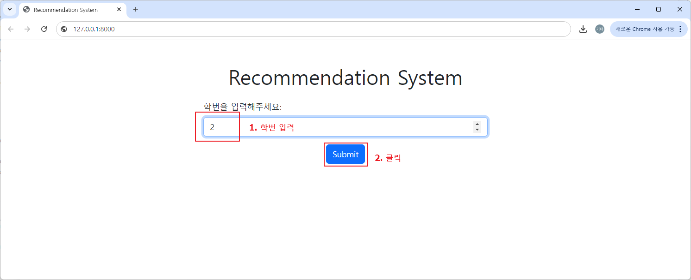

# 프로세스

    

## 웹 브라우저의 URL 입력칸에서 "127.0.0.1" 엔터를 치면 메인 페이지가 로딩됩니다.

  

## 해당 학생의 학번을 입력하고, [submit] 버튼을 누릅니다.

  

## 프로세스의 순서에 따라 코사인 유사도를 구하고, 점수 분포가 가장 유사한 학생의 난이도를 구하여 요청한 학생의 Chapter1 ~ Chapter6에 해당하는 문제를 불러와 표시합니다.

